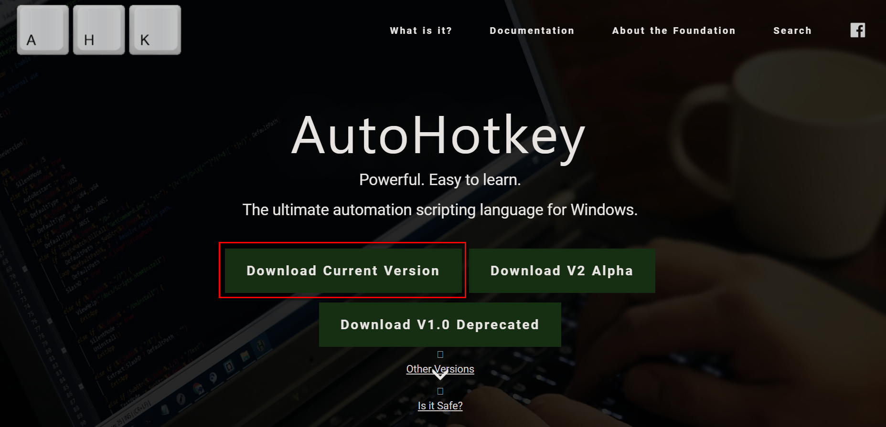
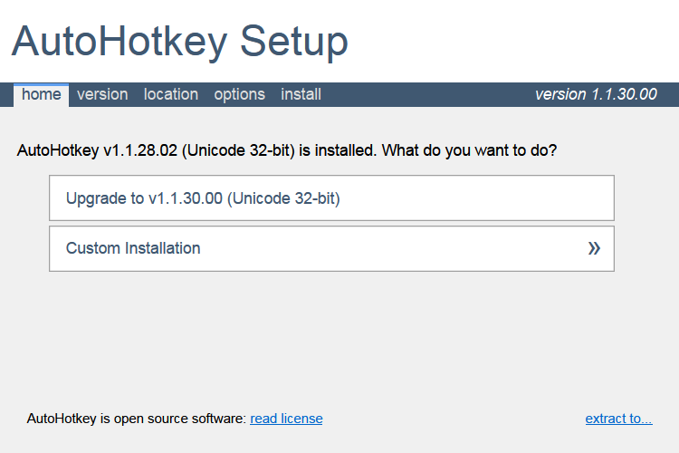
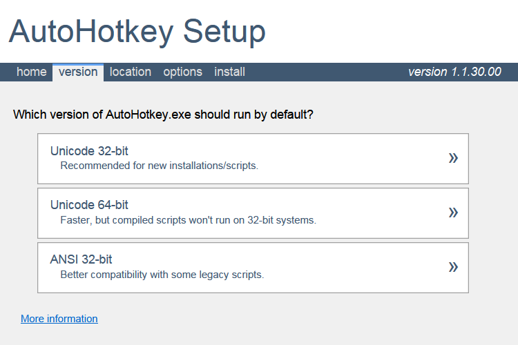
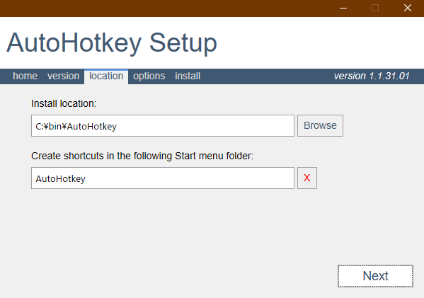
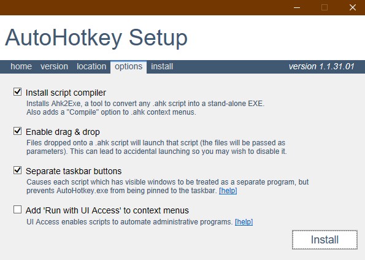

# Autohotkeyのインストール方法

## AutoHotKeyとは

* AutoHotKey(以下AHK)とは、マウスとキーボードの操作を前もって命令しておくことで、**単純作業を自動化する**ことのできるツール。
* オープンソースなので無料で使用可能
* windows操作のためのスクリプト言語を備えており、例えば以下のことが可能。

	* キーボードの入力
	* マウスカーソルの移動、クリック
	* コマンドの実行
	* `loop`や`if`文などの文法も備えている
	* GUIを持ったプログラムの作成も可能。
	* フォルダ内のファイルを取得して変数に入力することも可能

## インストール

* [こちら](https://autohotkey.com)のサイトにアクセスする。
* `Download`をクリックすると以下の画面が出てくるので、"Download Current Version"をクリック。

* ダウンロードされたexeファイルをダブルクリックしてインストール開始。
* 以下のような画面がでる。`custom installation`を選ぼう。

* 上の「version」タブに自動で移動する。3つの選択肢が出るが、お使いのマシンが32bitか64bitかに合わせて,`Unicode 32bit`か`Unicode 64bit`を選択する。

* `location`タブに自動で移動する。ここではインストール先とスタートメニューの名前を選択する。install locationの方は、よくアクセスするので使いやすい場所がお勧めですが、特にこだわりがなければデフォルトのままでも大丈夫です。

* 最後に`option`タブに自動で移動する。デフォルトのままでよい。一応の設定内容は以下の通りですが、気になる人だけ読んで下さい。

	* `Install script compiler`は、AHKをスクリプトから実行ファイルにするためのコンパイラーをインストールするかどうか。コンパイルのメリットについては後述するが、インストールしておいた方が便利なのでチェックしておく。
	
	* `Enable drag & drop`は、AHKスクリプトにファイルをドラッグandドロップした時、そのファイルをスクリプトの引数として取って実行することにするかどうか。最初はいらないと思うのでチェックを外そう。
	
	* `Separate taskbar buttons`は、複数のAHKスクリプトを起動した時にタスクバーに表示されるボタンを別々にするか一つにまとめるかどうか。別々にした方がいいのでチェックしたままにしよう。

	* 4つ目のはとりあえず気にしないでいいです。

* その上でinstallを押すとあっという間にインストールが終了する。

