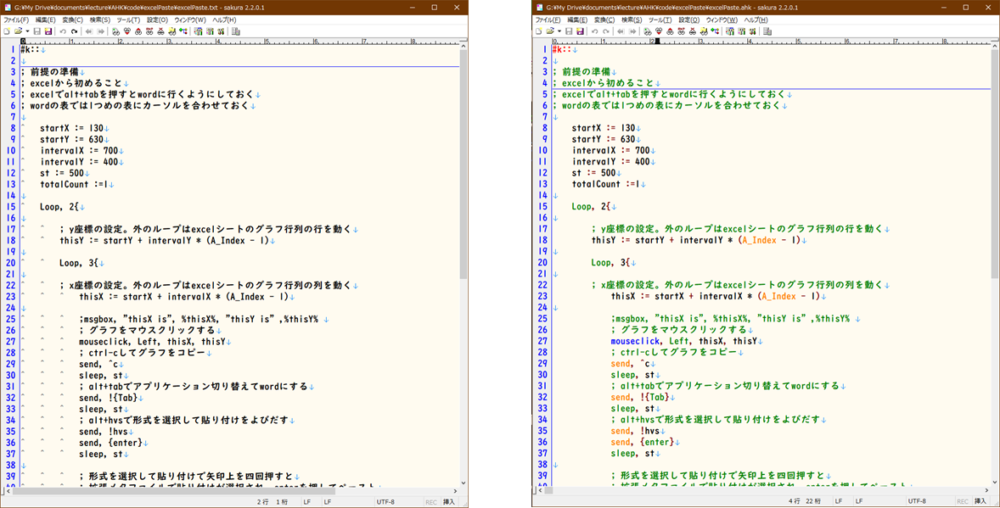
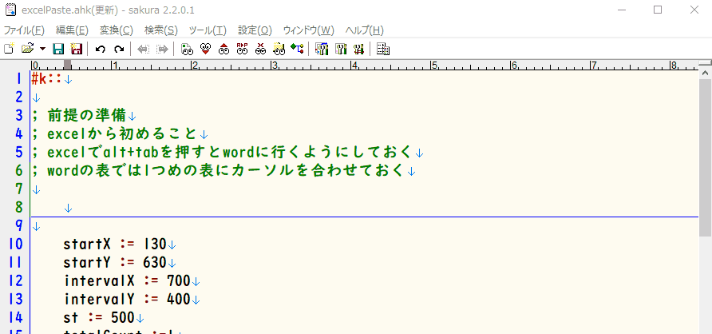
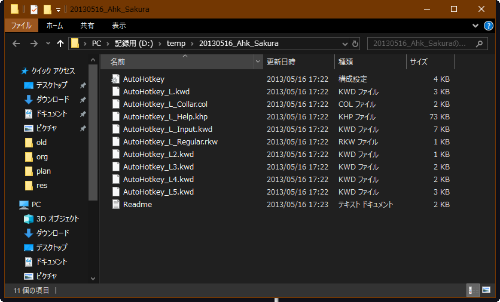
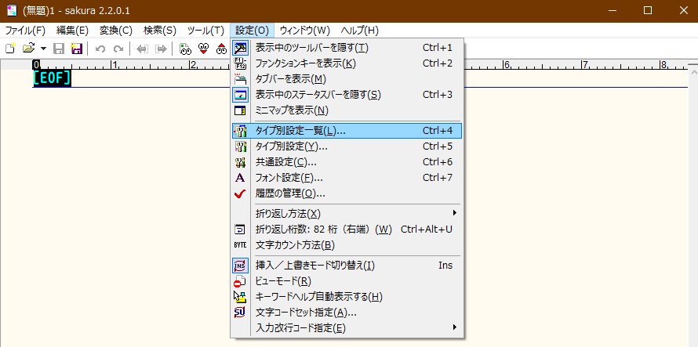
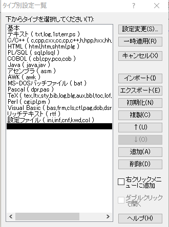
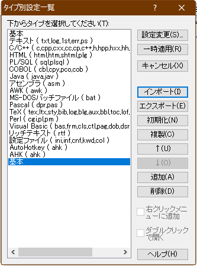

# AutoHotkeyのためのエディター

## はじめに

AHKのスクリプトを書く時には**エディター**を使います。エディターは**メモ帳**に代表されるような、文字を入力・編集してテキストファイルを作成するためのソフトです。

どのようなエディターでもスクリプトを書くことはできます。しかし、エディターは単にテキストファイルを作成するためだけのアプリではなく、頭の中のアイデアを具現化する出口でもあります。沢山のアイデアが泉の如く湧き出していても、その出口が細くつまっていては、折角の考えも効率よくまとまらなかったり、形にならずそのまま消えていってしまいます。

そのため、先人達(主にプログラマー)はエディターを最重要のツールと考え、多様なエディターが開発され、膨大な工夫がなされてきました。その歴史の中で開発されてきた二大エディターと呼ばれるのは`Emacs`と`Vim`ですが、今回の記事ではこちらは取り上げません。初めてエディタを使用するには敷居が高すぎるからです。

今回は日本語エディターとして人気の高いフリーソフトの「サクラエディタ」を例として取り上げ、AHKのプログラミングにおいて便利な機能を紹介していきたいと思います。エディターって大事だな、と思ったら、是非お気に入りのエディターを探してみたり、エディターの機能について試行錯誤してみて下さい。その作業を通じて、パソコンがより楽しく、より自由に使えるようになっていくと思います。

## よいエディターを使うメリット

### キーワードを色付け表示してくれる

プログラミング言語には、特別な命令を意味する文字列が設定されています。例えば、エクセルマクロで`for`を指定すると、それは指定回数括弧の中の操作を繰り返すことを意味します。

このような「特別な文字列」はプログラミング言語毎に固有の単語が設定されており、先述の`for`は`python`でも`for`ですが、`fortran`なら`do`ですし、AHKの場合は`Loop`という言葉が割り当てられています。

プログラミング言語固有の言葉はここではキーワードと呼びますが(予約語とも呼ばれます)は、プログラムの処理フローを規定していたりするので、目立つように表示されていると流れが頭に入ってきやすくなり、視認性が高まります。

以下はサクラエディタでAHKの色付け表示を行う前(左)と後(右)の図です。コメントやキーワードが色付けされていて、見易くなっています。また、キーワードのつもりで入力したのに色付けされない場合に、スペルミスに気付くこともできるというメリットもあります。



### 自動補完を行ってくれる

キーワードを色付けしてくれるなら、もういっそのこと自動で入力してくれたら便利、と思いませんか？そんな怠け心を少しサポートしてくれるのが自動補完機能です。プログラミング言語における予約語の最初を少し入力すると、スマホの入力画面のように一致するものがリストで表示されるので、その中から選択すればよい、という機能です。これも上手く使えばスペルミスを減らすことができます。また、サクラエディタの場合はコマンドの簡単な説明や引数がポップアップで表示されるようになっているので、正確に覚えていないコマンド(そんな場合が殆どです)の使い方を、ドキュメントを開かなくても取得することができる、という優れ物です。

以下の例では、「mouseClick」というAHKの命令を入力したい時に、mouse、まで打った後で自動補完を実施した例です。ポップアップウィンドウにmouseから始まるコマンドとその説明が表示されているのが分かると思います。



### その他の便利機能

優れたエディターに備えられた便利機能は他にも沢山あります。例えば、

* インデント(字下げ)を賢く入力。改行した時に前行のインデントを継続してくれるなど。
* カーソルの移動に様々な工夫がなされている。ショートカットキーが用意されていたり、移動のための特殊なモードが用意されていたりする。

余りにも機能が多すぎて逆に手を出し辛くなっているのは否めませんが、だからこそ使い込なせた時には愛着が湧きますし、先人達の様々な工夫は必ずや生産性向上に寄与するはずです。

なにより、パソコン作業において「文字を入力する」ということは非常に基本的・根本的なことですので、そのための道具をできるだけいいものを選ぶ、というのは、大工さんが精確な工具を選択したり、音楽家がよい楽器を大事にするようなものだと思います。

エディターを選び勉強するということは、「何かもっといい方法はないか」と工夫を考える習慣をつけるためのよい訓練になると思いますので、自分のペースでゆっくりとでも、エディター選びの旅を続けていくことをお勧めします。

## サクラエディターのインストールと設定

### インストール

[こちら](https://sakura-editor.github.io/download.html)が本家サイトでダウンロードして下さい。

ダウンロード終了後、ダブルクリックをしてインストールをして下さい。

ここではインストールしたフォルダを`c:\sakuraEditor`とします。

### サクラエディタでAHKを使いやすくする設定

インストールが終了したら、AHK用の設定を行います。まず、以下の設定ファイルをコピーします。

[こちら](http://ahkwiki.net/Sakura)からダウンロードできます。

このファイルを展開するとフォルダが一つありますが、その下に複数ファイルが保存されています。これを先程インストールしたサクラエディタのフォルダの中にある`keyword`フォルダにコピー(つまり今の場合は`c:\sakuraEditor\keyword`)して下さい。

```



**上のファイルを`c:\sakuraEditor\keyword`にコピー**

次に、コピーした設定ファイルをサクラエディタで機能するようにします。

以下の設定を行うことで、AHKのスクリプトファイルの拡張子は`ahk`ですが、サクラエディタは拡張子が`ahk`のファイルを編集している時に、AHK用の設定ファイルを適用して、キーワードに色を付けたり自動補完を行ったりできるようにします。

まず、サクラエディタを起動して、**設定(o)→タイプ別設定一覧(L)**をクリックします。



すると以下の画面が出てくるので**インポート(I)**をクリックします。



ファイルの選択画面が表示されます。先程設定ファイルをコピーしたフォルダへ移動(`c:\sakuraEditor\keyword`)してください。そこで、`AutoHotkey.ini`を選択して下さい。

警告などが出ますが無視して「上記条件でインポートします。」と表示させて、OKを押して下さい。

すると、先程の「タイプ別設定一覧」の画面に戻りますが、一番下に「基本」というのが増えています。ここにカーソルを合わせて、右上の**設定変更(S)**を押して下さい。



「タイプ別設定」という画面が表示されます。ここで変更するのは「スクリーン」タブの以下の項目です。

* **設定の名前(N)**を`AutoHotkey`にする
* **ファイル拡張子(X)**を`ahk`にする

好みですが、「レイアウト」にある「TAB幅」も変えてもいいでしょう。これはタブキーを押した時の字下げの文字数で、デフォルト設定の4だと、タブキー一つが半角スペース4つ分になります。4だと字下げを階層にいく時に空きすぎるので、僕は2にしています。

以上で、拡張子がahkのファイルを読み込むと、AHK用の設定が適用されるようになります。

