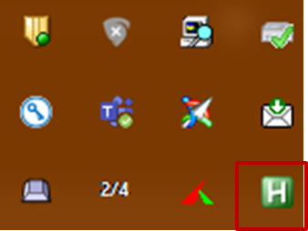
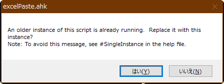

# はじめてのAHKコード

## 始めに

今回はAHKの基本的なコードの書き方を学ぶために以下の題材を取り上げます。

**エクセルでコピーしたグラフをワードで拡張メタファイルで貼り付けをワンタッチで行う**

とても単純ですが、AHKのコードの最重要エッセンスが含まれています。是非自分で書いて(写して)実行してみて下さい。

## 実行したいことをまとめる

始めにでも述べたように、目的は「エクセルのグラフをワードで拡張メタファイルで貼り付けをワンタッチで行う」です。まず一番最初に行うことは、**自分が行う操作を書き出してみる**ことです。こうすることで、何をどのような順番でAHKのコードにするのかが明確になります。

それでは、皆さんもエクセルとワードを立ち上げて実際に貼り付けてみて下さい。それを書き下してみると、多少人によって違うと思いますが、以下のようになると思います。

1. エクセルでのグラフをクリップボードにコピーは、既に行っているものとする
1. また、ワードで貼り付けたい場所にカーソルを置いているものとする
1. **Alt**キーを押す。

	* すると上部メニュー(リボンと言います)に黄色のアルファベットが出る。

1. **H**キーを押す。

	* するとリボンの「ホーム」が選択される

1. **V**キーを押す

	* すると「ホーム」タブの「貼り付け」に移動する

1. **S**キーを押す

	* すると「貼り付け」の中で「形式を選択して貼り付け」が選択される。
	
1. 「形式を選択して貼り付け」のウィンドウが表示されたら、**上**キーを四回押す。

	* すると「拡張メタファイル」にカーソルが移動する。

1. **Enter**キーを押す。
* すると「拡張メタファイル」で貼り付けが実行される。

このように、自分が実行する操作を順番に書いてみましょう。それができれば後は一つ一つの操作をAHKの命令に置き換えていくだけです。

## 今回のコード

それでは上の手順をAHKのコードにしたものを以下に示します。

```AutoHotkey

;wordに形式を選択して貼り付けを行うAHK
;前提条件
;エクセルの図をクリップボードに貼り付けている状態から始める
;ウィンドウフォーカスはwordに合わせておく


+#k::												;起動のショートカットキーを設定する
{														;スクリプトの中身を示すかっこを付ける
	send, !hvs								;sendでキーボードのキーを送る
	sleep, 500								;sleepで少し待つ。
	send, {up}{up}{up}{up}		;sendで矢印上を4回送る
	sleep, 500								;sleepで少し待つ
	send, {enter}							;enterキーを押す。
	return										;スクリプトの終了を示すreturnを送る
}														;本体部分の終了のかっこを付ける
```

### コメントの書き方

コメントとは、人間のための覚書・メモで、コンピュータからは無視される部分のことです。
プログラムはコンピュータさえ理解できればいい(つまり動作すればよい)、と考えてしまいがちですが、人間もコンピュータと同じ以上の時間プログラムを読むことになります。プログラムは後で再利用できるからこそ、もう一度同じことをする時間が省け効率化に繋がるわけですが、その「後」がいつくるのかは誰にも分かりません。その時が来たとき、自分で書いたコードでもすっかり忘れてしまっていることでしょう。勿論コードを入念に読み、何を意図したものなのか論理を追うことはできますが、それには一般に非常に時間がかかります。また、ちょっとだけ修正したい時はどうでしょうか。各行が何をしているのか人間が分かる形で書いてあれば、修正したいところも一目瞭然です。さらに、他人の書いたコードを使わせてもらう場合はどうでしょうか？コメントがあったら分かりやすいんだけどなぁ…と必ずや感じるはずです。そして、1ヶ月前の自分が書いたコードは他人が書いたコードと同じ、とよく言われます。それくらい、コードに関する記憶力は過信しない方がよい、ということです。
そのために、一体何を意図して書いたコードなのか、自分のためのメモを書くくせを是非付けて頂きたいと思います。プログラミングに慣れない内は一行ずつにその意味をコメントとして書いてもいいでしょう、いい勉強になります。慣れてきたら、一つの意味のある動作の塊に対してコメントを書く、という書き方もよいでしょう(私はそうしています)。

AHKにおいてコメントの書き方は、**`;`を書いた以降のものが全てコメントとしてみなされます。**
文頭に`;`を書けば、その行は全てコメントとなります。また上記コード6行目以降のように、命令を記載した後に`;`を打てば、それ以降がコメントとしてコンピュータからは無視されます。

最初にこのプログラムの目的を簡単に記載しておきましょう。そして、AHKでコメントを書く注意点として、**起動する時の前提条件を記載しておく**ということが言えます。例えばAHKでペーストする命令を送った時、ワードにカーソルが合っているかパワーポイントかで、貼り付けられる場所が変わるわけです。つまり、実行される時の状況に合わせて実行結果は変わります。ここでは、ワードに貼り付けたいならワードを起動させて貼り付けたいところにカーソルを合わせておくことが必要になります(AHKの機能の中には、特定のアプリケーションにカーソルを合わせることも可能です。そのため必ずしも、ここで述べたようにワードにカーソルを合わせなくてもいいのですが、そのような機能の説明は後に回します)。このように、どのような状況で実行することが想定されているかということは、プログラムが意図通りに動作するために不可欠なことなので、忘れないように、また他の人に渡してもすぐ使ってもらえるように、ちゃんと最初に明記しておきましょう。

上記で示したサンプルコードでは、まずこのAHKコードが行う目的、そして、実行時に準備しておくべきことを「前提条件」として記載しています。

### 処理の起動方法の設定(`+#k::`)

`::`が示すのは、**この前のキーが押されたら、次の`{`と`}`に囲まれた処理が行われる**ということです。つまり、ここで設定されたキーはAHKの「起動キー」と言えるでしょう。

起動キーには様々なキーを設定することができます。例えば`k`を押すと処理が始まるように設定することもできます。しかしこのような設定をしてしまうと、アルファベットとしての`k`を入力したいだけなのに、AHKの処理が始まってしまうようなことになり、困ってしまいます。これは極端な例ですが、例えば`Ctrl+V`(コントロールキー+V)に設定したとすると、通常のwindowsアプリケーションでは`Ctrl+V`はペーストに設定されているので、キーの設定が重複してしまい、これまた困ってしまいます。

そのため、**修飾キー**を付けて起動キーを設定しましょう。修飾キーとは、キーと同時に押すことで役割を変えるためのキーで、ショートカットを使用する時に使うControlキーなどは、日常的に使用されているものと思います。代表的な修飾キーは、**Control(Ctrl)**、**Alt**、**Shift**、そして**win**キーです。他の修飾キーと比べると少しマイナーなキーではないかと思いますが、windowsマークが付いた左下辺りにあるキーです。winキーの利用方法としては、`win+D`でデスクトップ表示、`win+↑`でウィンドウを上に移動または最大化など、便利な機能が実は結構あるので、使ってみて下さい。

各修飾キーには、それぞれを示す記号が以下のように設定されています。

| 修飾キー名 | AHKでの記号 |
| ---------- | ----------- |
| Shift      | +           |
| Alt        | !           |
| Control    | ^           |
| win        | #           |

今回のサンプルコードで設定した`+#k`は**shiftキー+winキー+k**を意味することになります。ここで行っているように、`+#`はshiftとwinを同時押しするように、**修飾キーを二つ同時に押しながらの設定も可能**です。

どのような起動キーを設定するかは、重複がなければなんでもよいのですが、アプリケーション独自のショートカットキーも沢山存在しているので、重複しているかどうか調べるのが一苦労です。そのため、あまり設定されていない`shift+win`キーの使用がお勧めです。重複がある場合には挙動がおかしくなるので、テスト実行ですぐに分かります。その時に起動キーを変更する、という対応でもよいでしょう。

## sendでキーを送る

さていよいよAHKの本体です。ここで、`send`というコマンド(命令)が登場しました。これは、**,以下の文字を打つ**ことに相当します。ここでは、`!`、つまり先程の修飾キーの表を参照して頂きたいですが、Altキーを押しながら`h`、`v`、`s`キーを順番に押す、ということを意味します。これは、「実行したいことをまとめる」で書いた以下のことに該当します。

1. **Alt**キーを押す。

	* 上部メニュー(リボンと言います)に黄色のアルファベットが出る。

1. **H**キーを押す。

	* リボンの「ホーム」が選択される

1. **V**キーを押す

	* 「ホーム」タブの「貼り付け」に移動する

1. **S**キーを押す

	* 「貼り付け」の中で「形式を選択して貼り付け」が選択される。

AHKのコマンドは沢山あり、今後随時紹介していく予定ですが、以下のようなルール(文法)に従って記述することは共通です。

```
コマンド, 引数1, 引数2, ....
```

引数(ひきすう)とは、コマンドの入力値で、関数に渡す変数のようなものと考えると分かりやすいでしょう。コマンドはある一定の動作をしますが、その際に与えられる入力値を使って定められた処理を行い、結果をアウトプットします。引数の数はコマンドによって異なりますが、コマンドを文頭に書いて`,`(カンマ)で区切る、という書き方は共通ですので、覚えておいて下さい。

## sleepで少し待つ

さて、上記コマンドのsendの結果として、「形式を選択して貼り付け」の画面が表示されることになりますので、次の操作である↑(矢印上キー)を送りたくなると思いますが、ここで注意点があります。

ここで「形式を選択して貼り付け」の画面が表示される際に、内部的にはこの画面を呼び出すためにほんの少し時間がかかります。一方、AHKの命令は、自分が意図した画面が表示されているかどうかについては考えません(考える方法は用意されているので後で解説しますが、最初は複雑になるのでその方法は使用しません)ので、もしかすると、画面が表示される前に、次の`send`の命令が実行されてしまうかもしれません。

するとどうなるか。もし画面が表示される前に↑キーが送られたとすると、そのキー操作は「何もしない」ことになります。画面が表示されている状態で↑キーを押すからこそ、カーソルが移動するわけです。画面が出ていない状態で送っても、何も起こらず、結果として意図した通りの(この場合は画面が出てから↑キーを4回押してカーソルを拡張メタファイルのところに移動させる)動作が実行されないことになります。

これに対処する方法として、最も単純な方法ですが、**ちょっと待つ**ことが挙げられます。`sleep`というコマンドは、まさにこのちょっと待つ、ということを実行するコマンドです。

```autoHotkey

sleep, 待つ秒数(単位はミリセカンド)

```

あまり待ちすぎると動作が遅くなりますので、ほどほどに(200とかでよいと思いますがPCの状態にもよるので、試行錯誤してみてください)しましょう。

ちょっとした処理と処理の間でもなるべく`sleep`を挟んで、安全運転をした方がよいと思います。

この方法は、一瞬だけ待つような場合には使えますが、例えばファイルの読み込みで比較的長い時間を、しかも前もって待ち時間が分からないような場合には使えません。そのような場合には、別のコマンドがあるので御安心下さい。そちらの紹介はまたします。

## 特殊キーの書き方

アルファベットのキーボードはそのまま記載すればいいのですが、↑キーやスペースキーなど、特殊キーには名前が割り当てられています。`{keyname}`という形式で記載します。以下に代表的な特殊キーを記載しておきますが、一覧は[こちら](http://ahkwiki.net/KeyList)でご覧下さい。

| キーボード上での名前        | AHKでの表現方法            |
| --------------------------- | -------------------------- |
| ←、→、↓、↑                  | {Left},{right},{down},{up} |
| スペース                    | {space}                    |
| エンター                    | {enter}                    |
| バックスペース              | {BS}もしくは{Backspace}    |
| デリート                    | {Delete}                   |
| タブ                        | {Tab}                      |
| ファンクションキー(F1～F24) | {F1}～{F24}                |
| エスケープ                  | {ESC}                      |

## returnで終了

`return`というコマンドを記載すると、その処理は終了します、ということになります。書かなくても最後まで行けば自動的に終了するのですが、意識的に終了しましたということを示すためにも、書いておくことをお勧めします。

## AHKを実行してみよう。

AHKのスクリプトをエディターで書いたら、拡張子を`ahk`にして保存しましょう。
そして、そのファイルをダブルクリックすると、常駐状態になります。右下のタスクバーに以下のようなマークが出れば常駐しています。



この状態で、起動キー(今回の例では`シフト+win+K)を押すと実行されます。

また、コードに文法的な間違いがあったりすると、エラーが表示されます。その時はエディターで書き換えて、再度ahkファイルをダブルクリックして下さい。すると以下の画面が出てきます。これは、「同じ名前のファイルが起動しているけど新しいので置き換えてよいか？」という質問ですので、新しいものを再実行したい場合はYesを選んで下さい。



## おわりに

これで基本的なAHKのスクリプトが書けるようになりました。AHKによる自動化とは、キー操作を自動で入力する、ということの感覚を掴んでもらえたでしょうか？この感覚をベースに、条件分岐やループ処理、AHKならではの便利なコマンドなど、実用的な機能を今後解説していきたいと思いますので、まずは今回のような単純なスクリプトを書けるようにしてください。

以下に簡単な練習問題を挙げておきますので、チャレンジしてみるのもいいでしょう。
