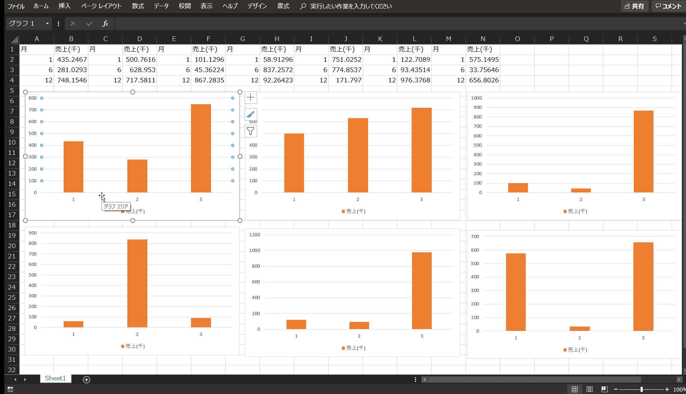

# AHKで色々やってみよう(その1)

## はじめに

前回でAHKの基本的な文法や命令を学びました。もちろんAHKでできることはそれだけではありません！今回は**エクセルで作成した複数の図をワードの表に貼り付ける**自動化に挑戦したいと思います。その中で以下のnew topicsを取り上げます。

* アプリケーション(ワード⇔エクセル)の切り替え
* マウス操作
* 繰り返し命令(ループ構文)

## AHKコードの実行内容

以下のことをAHKによって行います。

* エクセルの図の上にマウスカーソルを動かしクリップボードにコピー
* エクセルからワードにアクティブなウィンドウを切り替え
* 貼り付けたいワードの表にカーソルを移動
* 「形式を選択して貼り付け」で拡張メタファイルを選択して貼り付け
* エクセルに戻って次の図を選択し同様のことを繰り返す



マウスの動きが素早すぎて(またgifでフレームが間引いているので)、はっきり見えないかもしれませんが、エクセルがアクティブな時にはマウスが動いています。ワードでは表を右上から左下まで順に移動してペーストしているのが分かると思います。

## サンプルコード

サンプルコードを以下に示します。[こちら]()からダウンロードもできます。

いきなり長いコードに圧倒されるかもしれませんが、一つずつ見ていきましょう。

```AutoHotkey:

#p::
	pause

#k::
{
; 前提の準備
; excelから初めること
; excelでalt+tabを押すとwordに行くようにしておく
; wordの表では1つめの表にカーソルを合わせておく

	startX := 130
	startY := 630
	intervalX := 700
	intervalY := 400
	st := 800
	totalCount :=1

	Loop, 2{

		; y座標の設定。外のループはexcelシートのグラフ行列の行を動く
		thisY := startY + intervalY * (A_Index - 1)

		Loop, 3{

		; x座標の設定。外のループはexcelシートのグラフ行列の列を動く
			thisX := startX + intervalX * (A_Index - 1)

			IfWinExist, ahk_class XLMAIN
				{
				WinActivate, ahk_class XLMAIN
					; グラフをマウスクリックする
					mouseclick, Left, thisX, thisY
					; ctrl-cしてグラフをコピー
					send, ^c
					sleep, st
					; alt+tabでアプリケーション切り替えてwordにする
					}

			; word側で貼り付け
			WinActivate, ahk_exe WINWORD.EXE
			sleep, st
	
			; alt+hvsで形式を選択して貼り付けをよびだす
			send, !hvs
			sleep, st
			

			; 形式を選択して貼り付けで矢印上を四回押すと
			; 拡張メタファイルで貼り付けが選択され、enterを押してペースト
			Loop, 4{
			send, {up}
			sleep, st
			}
			send, {enter}
			sleep, st

			; wordの表で選択している表を移動するためにtabを押す。
			; 繰り返し回数が2で割り切れる時は名前を飛ばさないといけないので
			; tabを3回入力する。割り切れない時はtabを一回押す。

			if (mod(totalCount, 2 ) = 0 ){
				Loop, 3{
				send, {tab}
				}
				}
			else{
			send, {tab}
			}

			; 総繰り返し回数を保存する。上記の表移動回数の設定に使用する。
			totalCount := totalCount + 1

			WinActivate, ahk_class XLMAIN
			sleep, st

		}
	
	}

return

}

```

### いつでも中断できるようにしておこう

AHKのコードを書き終わり実行テストしてみると、全く意図したものと違う動作をする時はよくあります。この原因として一番多いのは、自分のやりたいことが、コードに論理的に反映されていない場合です。コードが正しく動作するか確認するためには、論理的に正しいかどうか頭の中で考えるよりも、実際に動かしてみてどのような挙動を示すのか、実験する方が早い場合が多々あります。

そのため、実験はAHKにおいても素早くコードを完成させるための重要なステップです。しかし、どう動くかわからないコードを実行したら、びっくりしてしまうような挙動を始めてしまうかもしれません。特にAHKはキー操作を送るので、なにかしらのキー操作が実行されることになり、運が悪いとファイルの上書きなどを実施してしまうこともありえます。こんな不安を抱えながらでは、おいそれとは試しに実験できませんよね。

つまり、安心して気楽に実験を開始させるためには、失敗したと分かったらすぐに中断できるようにしておく必要があります。

もちろんAHKには実行中のコードを即中断するための命令が用意されています。その名も`pause`です。
新しいコードを書く時には、`pause`コマンドを実行できるようにするために、まず以下のコードを書いておきましょう。

```
#p:: pause
```

このコードが意味するのは、winキー+pを押すと、実行中のコードがすぐに中断される、ということです。コードを実験する時は、win+Pをいつでも押せるように準備して、変な挙動を始めたら、まずはwin+Pを押してAHKを止めましょう。

因みに、あくまで中断であり終了ではないので、もう一度winキー+pを押すと、中断したコードが再開されることになります。


## ループ

**何らかの操作を繰り返したい**、という時には`Loop`という構文を使用します。以下のコードをご覧下さい。

```
Loop, 3{

	send, {up}
}
```

このコードが意味するところは、`Loop`の`{`と`}`に囲まれた文章を3回繰り返す、つまり上キーを三回押す、ということで、`send,{up}{up}{up}`と全く同じことを行います。

ループ構文の一般的な書き方は、`Loop, 繰り返したい回数{繰り返したい命令}`となります。

かっこの中には複数の命令を書くこともできますし、更にループの中で新たなループを設定することもできます。

また、ループ内で使用される特別な変数(変数は後述しますが、値を入れることのできる箱だと思って下さい)として`A_Index`があります。
これはループ内での何回目の繰り返しなのか、という数を格納しています。

AHKが自動で用意する変数なので、自分で定義しなくても使用することのできる変数(**組み込み変数**といいます)です。
ループの何回目かに応じて処理を変えることはよく行うので、`A_Index`はとても便利な組み込み変数です。どんどん使いましょう。

## 変数定義

一般的なプログラミング言語と同様、AHKでも変数を定義することができます。変数とは、**何かを入れておく箱**と考えておくとよいでしょう。

変数を定義するための構文は、`変数:=入れたい値`のように、`:=`を使います。

それでは、なぜ変数を使用するのでしょうか？

1. プログラム上で計算された結果を格納することができる。

	今回のプログラムから抜粋した以下の部分を見てみましょう。`A_Index`は先述したように、「現在繰り返しの何回目か」を格納する変数です。この繰り返しの数を`intervalY`に乗じ、`startY`に加算した結果を`thisY`に格納しています。
```
  ; y座標の設定。外のループはexcelシートのグラフ行列の行を動く
        thisY := startY + intervalY * (A_Index - 1)
```
	
	このように`thisY`に計算結果を入れておけば、後で呼び出して使用できることができます。


1. 何度も使用する値を同じ名前で指定することができる。

	どういうことか、以下の例で見てみましょう。  

	前回`sleep`コマンドで、AHKではキーボードやマウス操作が完了するまで少し待つ必要がある、という話をしました。  
	その時の「待ち時間」は`sleep, XX`の、XXの所(コマンドの**引数**と言います)に数値を代入することで指定することができます。  
	どの程度の待ち時間が最適かは、CPUの使用状況やPCのスペックや状態にも依存するので、最初は安全に長めの待ち時間を指定しておき、もっと待ち時間を少なくして速度を上げたいと思ったら、少しずつ小さくしてみるといいでしょう。

	そのような試行錯誤したい時に、大量にある`sleep`コマンドの引数を全て書き換えないといけないとすると、やる気を失いますよね。しかし、変数を最初に定義して、その変数を`sleep`コマンドの引数として指定しておけば、待ち時間の変更は**変数定義の部分を書き換えるだけで済む**わけです。
	
	以下のコードでは、`sleep, st`が何度も登場しますが、最初の`st :=800`を変更すれば(例えばもっと短くしたいのであれば`st :=200`に変更するなど)、一箇所の変更ですみますので、試行錯誤したい時にとても楽になります。

```
	st := 800
 	send, ^c
  sleep, st
  send, !hvs
  sleep, st
  Loop, 4{
    send, {up}
    sleep, st
         }
```

1. 変数の名前からプログラム上の役割が分かる

	コードが長くなってくると、その数値や文字列がどのような意図で使われているのか分からなくなってきます。しかしもし変数の名前が端的にその役割を示すようなものであれば、忘れることはありません。コメントが常に一緒に居るような感じでしょうか。その点で変数は、引越しの時後で中に何が入っているかすぐ分かるように箱の外側に中身をマジックで書いておく、ようなものです。例えば以下のコードをご覧下さい。

```
    startX := 130
    startY := 630
    intervalX := 700
    intervalY := 400

    Loop, 2{

        ; y座標の設定。外のループはexcelシートのグラフ行列の行を動く
        thisY := startY + intervalY * (A_Index - 1)

        Loop, 3{

        ; x座標の設定。外のループはexcelシートのグラフ行列の列を動く
            thisX := startX + intervalX * (A_Index - 1)

                    mouseclick, Left, thisX, thisY
								}
					 }
```

  このコードは、繰り返し処理をしながらマウスカーソルをクリックするのですが、その時のx座標とy座標を`thisY`と`thisX`に格納しています。  
  また、`mouseclick, left, thisX, thisY`で「x座標=thisX、y座標=thisYを左クリック(leftで指定)する」コマンドです。  
	繰り返しループ毎にx座標とy座標が計算され、その座標にマウスカーソルを移動・クリックさせます。  
	この時基点になるx,y座標をそれぞれ`startX`,`startY`とし、x,y座標で移動させる間隔を`intervalX`,`intervalY`、そしてx,y座標のその時用いる値を`thisX`,`thisY`としています。  
	もしこれらの値を`x1`,`x2`,`x`のように命名した変数を使用していたら、すぐにどれがどれがか分からなくなり、計算式を間違って書いてしまう可能性大です。  
	しかしそれぞれに、基点を意味するstart、間隔を意味するinterval、その時の、を意味するthisと名付けておけば、数ヶ月後にコードを読み返すようなことがあっても、簡単にその意味を思い出すことができます。  
	そのため、変数の名前を、情報を与えることのできるものにしておくことはコードの読み易さ(可読性)に繋がりますので、是非普段から心掛けるようにしましょう。
