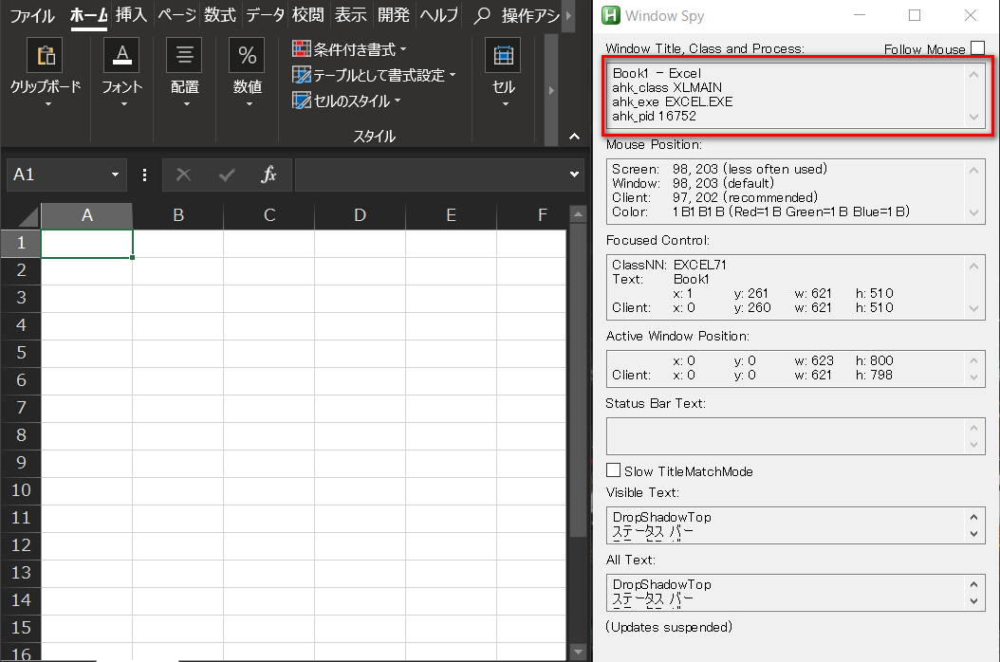

# AHKでいろいろやってみよう(その2)

## はじめに

前回ご紹介したコードの続きで、AHKでのウィンドウの指定の仕方について御説明します。AHKはキー操作を送るためのプログラミングソフトであるがゆえに、どの「ウィンドウ」にキーが送られるのか、ということはとても重要です。

そのためAHKには、**ウィンドウを指定する便利な方法**が多数用意されています。これを使いこなせれば、複数のソフトを切り替えながら行う操作に対して、簡単に指定することができるようになります。そのために必要な以下の項目を、順を追って説明していきましょう。

* ウィンドウとは
* ウィンドウをアクティブにする命令とウィンドウの指定方法
* ウィンドウ指定に関する命令

## ウィンドウとは

OSとしてのWindows(Windows10やWindows7,WindowsXPなど)は、その名前が表しているように、ソフトを「ウィンドウ」に表示させています。このウィンドウ内でユーザからの入力を受け付けて各種コマンドを実行する、というのが一般的なアプリケーションの使い方です。

操作が受け付けられるウィンドウは**「アクティブ」なウィンドウ**と呼ばれます。ウィンドウのタイトルバーが濃い色あいになっていることが多いでしょう。このアクティブウィンドウに対してキーボード操作は送られることになります。

AHKを使って作業を自動化する時も同様で、AHKのコードが送るキー操作はアクティブウィンドウに送られることになります。ですので、AHKのコードの中で、自分が操作したいソフトのウィンドウがアクティブになっているかどうか、ということは重要になります。

以下の節で、AHKにおいてアクティブなウィンドウをどのように扱っているのかを見ていきましょう。

## ウィンドウをアクティブにする命令とウィンドウの指定方法

AHKでは任意のウィンドウをアクティブにするための命令が用意されています。

```
WinActivate, ウィンドウ検索条件
```

このように、`WinActivate`は、引数で指定した条件に合致するウィンドウをアクティブにするAHKのコマンドです。うまく検索条件を指定すれば、自分のお好みのウィンドウをアクティブにすることができます。

それでは、ウィンドウの検索条件はどのように指定するのでしょうか？それには、以下の四つの方法があります。

* ウィンドウのタイトル       
	
	* ウィンドウのタイトルバーに表示されている文字列を書いて指定する。

* ウィンドウクラス

	* ウィンドウクラスとはウィンドウの種類に相当するもの。

* ウィンドウの実行ファイル

	* ウィンドウを起動している実行ファイルのこと。

* ウィンドウのプロセスID

	* ウィンドウを起動している実行ファイルに割り当てられたプロセス毎に割り当てられたID。同一の実行ファイルから起動したものでも個別のIDが振り分けられている場合もある。

さて問題は、上記の情報をいかにして入手するか、ということですが、AHKには`Window Spy`という(怪しげな名前の)ツールが付いてきます。
AHKをインストールしたフォルダ直下に`WindowSpy.ahk`というahkスクリプトがあるのでこれを起動して下さい。以下のような画面が表示されるはずです。



右が`WindowSpy`です。この赤枠で囲んでいる部分にウィンドウの情報が表示されています。この例は左のエクセルのウィンドウに関する情報を表示したもので、以下の表にその説明を記載しています。`WinActivate`で指定する時の指定の仕方も記載しておきます。

|ウィンドウの情報|対応する情報|WinActivateでの指定の仕方|
|:--------------:|:----------:|:------------------------|
|ウィンドウのタイトル|Book1 - Excel|WinActivate, Book1 - Excel|
|ウィンドウのクラス|XLMAIN|WinActivate, ahk_class XLMAIN|
|ウィンドウの実行ファイル|EXCEL.EXE|WinActivate, ahk_exe EXCEL.EXE|
|ウィンドウのプロセスID|16752|WinActivate, ahk_pid 16752|

`WindowSpy`を立ち上げると上記のウィンドウが表示され、アクティブなウィンドウの情報が表示されるようになっています。アクティブなウィンドウが切り替わる度に表示されている情報も更新されるため、自分が知りたいウィンドウをクリックして、情報を取得して下さい。

### WindowsSpyの補足

`WindowSpy`はウィンドウの情報以外に、マウスカーソルの場所についての情報も取得できます。(`Mouse Position`のところ)

また、各ウィンドウ毎に固有のIDが割り当てられており、それを使用する方法もありますが、その情報は`WindowSpy`では取得できません。そのIDの取得方法については発展的なのでここでは解説しませんが、[WinGet](http://ahkwiki.net/WinGet)などを使用して取得することが可能です。

## ウィンドウ指定に関する他の命令

前節でウィンドウの指定方法を学び、`WinActivate`を用いれば任意のウィンドウをアクティブにすることができるようになりました。しかしウィンドウに関する処理はとても重要なので、AHKには他にも様々な便利な機能が用意されています。

例えば今回のサンプルコードでも使用している`IfWinExist`について見てみましょう。この命令は、引数で指定したウィンドウが存在するかどうかで分岐処理を記載することのできる命令です。
  
```
; エクセルのウィンドウが存在するかどうか
IfWinExist, ahk_class XLMAIN
  {
		; エクセルをアクティブにする
		WinActivate, ahk_class XLMAIN
		; グラフをマウスクリックする
		mouseclick, Left, thisX, thisY
		; ctrl-cしてグラフをコピー
		send, ^c
		sleep, st
	}
; エクセルのウィンドウが存在しない場合
else
	{ 
		msgbox, エクセルが立ち上がっていません
		return
	}
```

`IfWinExist`の引数は、前節で`WinActivate`で説明した引数と同じ方法で指定することができます。ここでは、ウィンドウクラス(ahk_class)でXLMAIN(エクセルのクラス名)のものが存在する時は、最初のかっこ内の処理が実行されます。存在しない場合は、`else`以下のかっこ内の処理が実行されます。

このよく似た命令に`IfWinNotExist`があります。これは「指定したウィンドウが存在**しなかったら**」かっこ内の処理を実行する、という`IfWinExist`の逆の命令です。例えば「エクセルがまだ立ち上がってなかったら立ち上げよう」のような場合に有効です。

このようにウィンドウに関する処理はとても便利なのですj.他の類似の代表的な命令を挙げておきます。もし網羅的に知りたければ、[AHKWikiのウィンドウコマンド](http://ahkwiki.net/Commands_Category#window)がお勧めです。

|命令             |説明           |
|:---------------:|:-------------:|
|IfWinActive/IfWinNotActive:|指定するウィンドウがアクティブな場合の分岐処理|
|WinWait          |指定したウィンドウが存在するようになるのを待つ。|
|WinWaitClose     |指定したウィンドウが閉じるのを待つ|

## おわりに

AHKにおけるウィンドウ指定の方法を御説明致しましたが、いかがだったでしょうか？これを上手く使えば、プログラム上から明示的にアクティブなウィンドウを操作することができ、プログラムの柔軟性・堅牢性が大幅にアップすると思いますので、是非使いこなして欲しいと思います。
